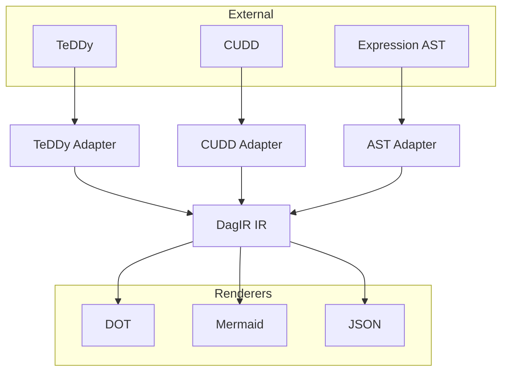

<!-- SPDX-License-Identifier: MIT
  Copyright (c) 2025 DagIR contributors -->
[](https://github.com/Alan-Jowett/dagir/actions/workflows/main.yml)
[](https://isocpp.org)
[](https://github.com/Alan-Jowett/dagir/security/code-scanning)
[](https://github.com/Alan-Jowett/dagir/actions/workflows/coverage.yml)
[](https://coveralls.io/github/Alan-Jowett/dagir?branch=main)
[](https://opensource.org/licenses/MIT)


# DagIR
**Traverse external DAGs and DCGs without copying and render them anywhere: DagIR builds a lightweight IR for DOT, Mermaid, or JSON — header‑only, C++20, cross‑platform.**

---

## ✨ Why DagIR?
Existing graph libraries assume you own the graph. DagIR is different:
- Works on **external graphs** (TeDDy, CUDD, expression DAGs/DCGs) without copying.
- Supports both **directed acyclic graphs (DAGs)** and **directed cyclic graphs (DCGs)** with cycle detection.
- Provides a **renderer-neutral IR** for DOT, Mermaid, JSON, or custom backends.
- Uses **policy-driven customization** for labels, styles, and metadata.
- Lightweight, **header-only**, and **MIT licensed**.

| Library | Ownership | Purpose | Rendering |
|---|---:|:---|:---|
| DagIR | Non-owning adapters | Build renderer-neutral IR for external DAGs | DOT / Mermaid / JSON (built-in)
| Boost.Graph | Owning containers | General graph algorithms & data structures | None (use external tools)
| Lemon | Owning containers | Network/graph algorithms, high performance | None



## ✅ Features
- **Concepts**: `read_only_dag_view`, `node_handle`, `edge_ref`.
- **Algorithms**:
  - `kahn_topological_order(view)` – Kahn's algorithm for DAGs.
  - `dfs_traversal_order(view)` – DFS traversal for DAGs and DCGs.
  - `detect_cycles(view)` – Cycle detection with SCC identification.
  - `postorder_fold(view, combiner)` – N-ary fold with memoization (returns map from node `stable_key()` to result).
- **IR**: `ir_graph` with nodes, edges, attributes, and optional cycle metadata.
- **Renderers**:
  - DOT (Graphviz)
  - Mermaid
  - JSON
- **Adapters**:
  - TeDDy
  - CUDD
  - Mock for testing.
- **DCG Support**: Optional cycle detection and marking in IR for directed cyclic graphs.

---

## 🚀 Quick Start
Add DagIR as a CMake dependency using `FetchContent` and then include the headers:

Use the included `examples/expression2tree` sample as a template. The example
demonstrates a minimal CMake setup that prefers a local repository checkout
but falls back to `FetchContent` when building the example standalone.

```cmake
cmake_minimum_required(VERSION 3.21)
project(expression2tree_sample LANGUAGES CXX)
set(CMAKE_CXX_STANDARD 20)

# Prefer local dagir checkout when present (in-tree build). Otherwise FetchContent.
include(FetchContent)
FetchContent_Declare(
  dagir
  GIT_REPOSITORY https://github.com/Alan-Jowett/dagir.git
  GIT_TAG main
)
FetchContent_MakeAvailable(dagir)

add_executable(expression2tree_main main.cpp)
target_include_directories(expression2tree_main PRIVATE ${dagir_SOURCE_DIR}/include)
```

The program code (see `examples/expression2tree/main.cpp`) is a tiny CLI that
parses an expression file into an AST, builds an `ir_graph` using expression
policies, and renders via DOT/JSON/Mermaid. Example usage after building:

Example usage:
```cpp
// Read and parse the expression from the specified file
my_expression_ptr expr = read_expression_from_file(filename);

// Create a read-only DAG view over the parsed expression AST
expression_read_only_dag_view dag_view(expr.get());

// Build an intermediate representation (ir_graph) from the DAG view
// Use expression-specific policies for node labels and edge attributes
dagir::ir_graph ir = dagir::build_ir(dag_view, dagir::utility::expression_node_attributor{},
                                      dagir::utility::expression_edge_attributor{});

// Render using the requested backend to stdout.
std::ostream& os = std::cout;
dagir::render_dot(os, ir, "expression");
```
---
## 📦 Installation
Preferred installation methods:

- **CMake (recommended)** — add DagIR via `FetchContent` or point your project at the repository's `include/` directory:

```cmake
include(FetchContent)
FetchContent_Declare(
  dagir
  GIT_REPOSITORY https://github.com/Alan-Jowett/dagir.git
  GIT_TAG main
)
FetchContent_MakeAvailable(dagir)

target_include_directories(your_target PRIVATE ${dagir_SOURCE_DIR}/include)
```

- **vcpkg (future)** — a vcpkg package will be provided; prefer this for integrated dependency management once available.

DagIR is header-focused; if you vendor the repo, add `include/dagir` to your include path or use the CMake approach above.

---

## 🛠 Roadmap
- [x] DOT renderer
- [x] Mermaid renderer
- [x] JSON renderer
- [ ] Parallel traversal
- [ ] Layout integration (Graphviz or drag)

---

## ✅ License
MIT License – free for commercial and OSS use.

---

## 🤝 Contributing
PRs welcome! Please see CONTRIBUTING.md for guidelines.

---

## Continuous Integration
This repository now includes GitHub Actions workflows to run sanitizer builds (ASAN/UBSAN) and collect coverage using `lcov`/Codecov. See `.github/workflows/main.yml` (sanitizer-tests job) and `.github/workflows/coverage.yml`.

