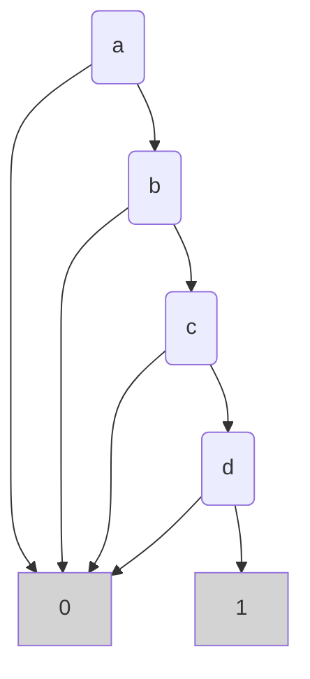

```mermaid
graph TB
  node000("a")
  node001("b")
  node002("c")
  node003("d")
  node004["0"]
  style node004 fill:lightgray
  node005["1"]
  style node005 fill:lightgray
  node000 --> node001
  node000 --> node004
  node001 --> node002
  node001 --> node004
  node002 --> node003
  node002 --> node004
  node003 --> node004
  node003 --> node005
```
