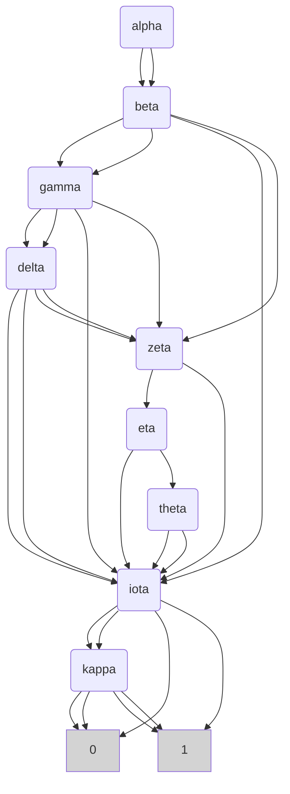

```mermaid
graph TB
  alpha("alpha")
  beta("beta")
  beta("beta")
  delta("delta")
  delta("delta")
  eta("eta")
  gamma("gamma")
  gamma("gamma")
  iota("iota")
  iota("iota")
  kappa("kappa")
  kappa("kappa")
  node15["0"]
  style node15 fill:lightgray
  node16["1"]
  style node16 fill:lightgray
  theta("theta")
  zeta("zeta")
  alpha --> beta
  alpha --> beta
  beta --> gamma
  beta --> gamma
  beta --> iota
  beta --> zeta
  delta --> iota
  delta --> iota
  delta --> zeta
  delta --> zeta
  eta --> iota
  eta --> theta
  gamma --> delta
  gamma --> delta
  gamma --> iota
  gamma --> zeta
  iota --> kappa
  iota --> kappa
  iota --> node15
  iota --> node16
  kappa --> node15
  kappa --> node15
  kappa --> node16
  kappa --> node16
  theta --> iota
  theta --> iota
  zeta --> eta
  zeta --> iota
```
