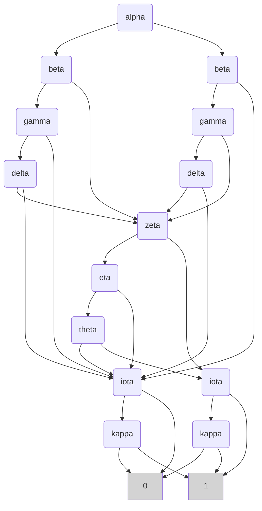

```mermaid
graph TB
  node000("alpha")
  node001("beta")
  node002("beta")
  node003("gamma")
  node004("gamma")
  node005("delta")
  node006("delta")
  node007("zeta")
  node008("eta")
  node009("theta")
  node010("iota")
  node011("iota")
  node012("kappa")
  node013("kappa")
  node014["0"]
  style node014 fill:lightgray
  node015["1"]
  style node015 fill:lightgray
  node000 --> node001
  node000 --> node002
  node001 --> node003
  node001 --> node007
  node002 --> node004
  node002 --> node010
  node003 --> node005
  node003 --> node010
  node004 --> node006
  node004 --> node007
  node005 --> node007
  node005 --> node010
  node006 --> node007
  node006 --> node010
  node007 --> node008
  node007 --> node011
  node008 --> node009
  node008 --> node010
  node009 --> node010
  node009 --> node011
  node010 --> node012
  node010 --> node014
  node011 --> node013
  node011 --> node015
  node012 --> node014
  node012 --> node015
  node013 --> node014
  node013 --> node015
```
