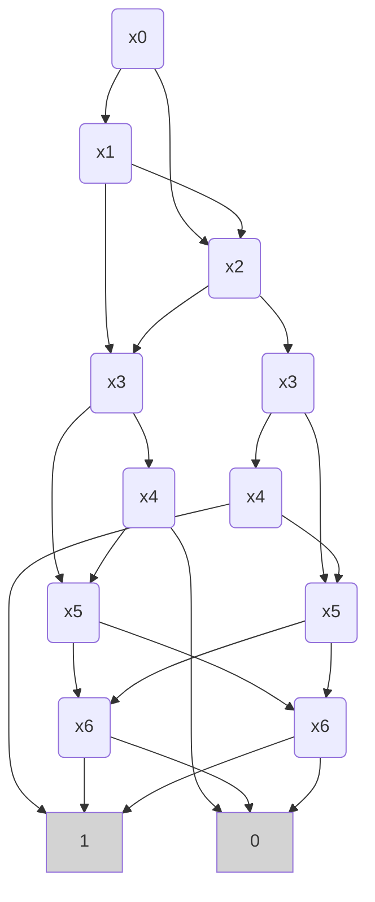

```mermaid
%%{ init: {"theme": "default"} }%%
graph TB
  node000("x0")
  node001("x1")
  node002("x2")
  node003("x3")
  node004("x3")
  node005("x4")
  node006("x4")
  node007("x5")
  node008("x5")
  node009("x6")
  node010("x6")
  node011["1"]
  style node011 fill:lightgray
  node012["0"]
  style node012 fill:lightgray
  node000 --> node001
  node000 --> node002
  node001 --> node002
  node001 --> node003
  node002 --> node003
  node002 --> node004
  node003 --> node005
  node003 --> node007
  node004 --> node006
  node004 --> node008
  node005 --> node007
  node005 --> node012
  node006 --> node008
  node006 --> node011
  node007 --> node009
  node007 --> node010
  node008 --> node009
  node008 --> node010
  node009 --> node011
  node009 --> node012
  node010 --> node011
  node010 --> node012
```
