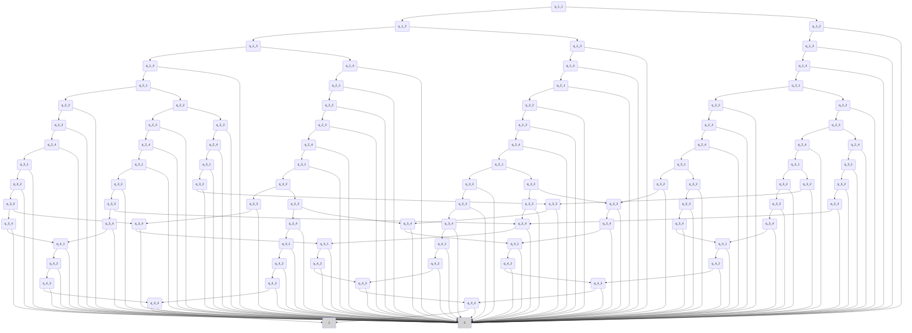

```mermaid
%%{ init: {"theme": "default"} }%%
graph TB
  node000("q_1_1")
  node001("q_1_2")
  node002("q_1_2")
  node003("q_1_3")
  node004("q_1_3")
  node005("q_1_3")
  node006("q_1_4")
  node007("q_1_4")
  node008("q_1_4")
  node009("q_1_4")
  node010("q_2_1")
  node011("q_2_1")
  node012("q_2_1")
  node013("q_2_1")
  node014("q_2_2")
  node015("q_2_2")
  node016("q_2_2")
  node017("q_2_2")
  node018("q_2_2")
  node019("q_2_2")
  node020("q_2_3")
  node021("q_2_3")
  node022("q_2_3")
  node023("q_2_3")
  node024("q_2_3")
  node025("q_2_3")
  node026("q_2_3")
  node027("q_2_4")
  node028("q_2_4")
  node029("q_2_4")
  node030("q_2_4")
  node031("q_2_4")
  node032("q_2_4")
  node033("q_2_4")
  node034("q_2_4")
  node035("q_3_1")
  node036("q_3_1")
  node037("q_3_1")
  node038("q_3_1")
  node039("q_3_1")
  node040("q_3_1")
  node041("q_3_1")
  node042("q_3_1")
  node043("q_3_2")
  node044("q_3_2")
  node045("q_3_2")
  node046("q_3_2")
  node047("q_3_2")
  node048("q_3_2")
  node049("q_3_2")
  node050("q_3_2")
  node051("q_3_2")
  node052("q_3_2")
  node053("q_3_2")
  node054("q_3_3")
  node055("q_3_3")
  node056("q_3_3")
  node057("q_3_3")
  node058("q_3_3")
  node059("q_3_3")
  node060("q_3_3")
  node061("q_3_3")
  node062("q_3_3")
  node063("q_3_3")
  node064("q_3_3")
  node065("q_3_4")
  node066("q_3_4")
  node067("q_3_4")
  node068("q_3_4")
  node069("q_3_4")
  node070("q_3_4")
  node071("q_3_4")
  node072("q_3_4")
  node073("q_3_4")
  node074("q_3_4")
  node075("q_4_1")
  node076("q_4_1")
  node077("q_4_1")
  node078("q_4_1")
  node079("q_4_1")
  node080("q_4_1")
  node081("q_4_2")
  node082("q_4_2")
  node083("q_4_2")
  node084("q_4_2")
  node085("q_4_2")
  node086("q_4_2")
  node087("q_4_3")
  node088("q_4_3")
  node089("q_4_3")
  node090("q_4_3")
  node091("q_4_4")
  node092("q_4_4")
  node093["1"]
  style node093 fill:lightgray
  node094["0"]
  style node094 fill:lightgray
  node000 --> node001
  node000 --> node002
  node001 --> node003
  node001 --> node004
  node002 --> node005
  node002 --> node094
  node003 --> node006
  node003 --> node007
  node004 --> node008
  node004 --> node094
  node005 --> node009
  node005 --> node094
  node006 --> node010
  node006 --> node094
  node007 --> node011
  node007 --> node094
  node008 --> node012
  node008 --> node094
  node009 --> node013
  node009 --> node094
  node010 --> node014
  node010 --> node015
  node011 --> node016
  node011 --> node094
  node012 --> node017
  node012 --> node094
  node013 --> node018
  node013 --> node019
  node014 --> node020
  node014 --> node094
  node015 --> node021
  node015 --> node022
  node016 --> node023
  node016 --> node094
  node017 --> node024
  node017 --> node094
  node018 --> node025
  node018 --> node094
  node019 --> node026
  node019 --> node094
  node020 --> node027
  node020 --> node094
  node021 --> node028
  node021 --> node094
  node022 --> node029
  node022 --> node094
  node023 --> node030
  node023 --> node094
  node024 --> node031
  node024 --> node094
  node025 --> node032
  node025 --> node094
  node026 --> node033
  node026 --> node034
  node027 --> node035
  node027 --> node094
  node028 --> node036
  node028 --> node094
  node029 --> node037
  node029 --> node094
  node030 --> node038
  node030 --> node094
  node031 --> node039
  node031 --> node094
  node032 --> node040
  node032 --> node094
  node033 --> node041
  node033 --> node094
  node034 --> node042
  node034 --> node094
  node035 --> node043
  node035 --> node094
  node036 --> node044
  node036 --> node094
  node037 --> node045
  node037 --> node094
  node038 --> node046
  node038 --> node094
  node039 --> node047
  node039 --> node048
  node040 --> node049
  node040 --> node050
  node041 --> node051
  node041 --> node052
  node042 --> node053
  node042 --> node094
  node043 --> node054
  node043 --> node094
  node044 --> node055
  node044 --> node094
  node045 --> node063
  node045 --> node094
  node046 --> node056
  node046 --> node057
  node047 --> node058
  node047 --> node094
  node048 --> node059
  node048 --> node060
  node049 --> node060
  node049 --> node094
  node050 --> node061
  node050 --> node094
  node051 --> node062
  node051 --> node094
  node052 --> node063
  node052 --> node094
  node053 --> node064
  node053 --> node094
  node054 --> node065
  node054 --> node067
  node055 --> node066
  node055 --> node074
  node056 --> node067
  node056 --> node094
  node057 --> node068
  node057 --> node073
  node058 --> node069
  node058 --> node094
  node059 --> node074
  node059 --> node094
  node060 --> node070
  node060 --> node094
  node061 --> node071
  node061 --> node094
  node062 --> node072
  node062 --> node094
  node063 --> node073
  node063 --> node094
  node064 --> node074
  node064 --> node094
  node065 --> node075
  node065 --> node094
  node066 --> node075
  node066 --> node094
  node067 --> node080
  node067 --> node094
  node068 --> node076
  node068 --> node094
  node069 --> node077
  node069 --> node094
  node070 --> node079
  node070 --> node094
  node071 --> node078
  node071 --> node094
  node072 --> node078
  node072 --> node094
  node073 --> node079
  node073 --> node094
  node074 --> node080
  node074 --> node094
  node075 --> node081
  node075 --> node094
  node076 --> node082
  node076 --> node094
  node077 --> node083
  node077 --> node094
  node078 --> node084
  node078 --> node094
  node079 --> node085
  node079 --> node094
  node080 --> node086
  node080 --> node094
  node081 --> node087
  node081 --> node094
  node082 --> node088
  node082 --> node094
  node083 --> node090
  node083 --> node094
  node084 --> node089
  node084 --> node094
  node085 --> node089
  node085 --> node094
  node086 --> node090
  node086 --> node094
  node087 --> node091
  node087 --> node094
  node088 --> node091
  node088 --> node094
  node089 --> node092
  node089 --> node094
  node090 --> node092
  node090 --> node094
  node091 --> node093
  node091 --> node094
  node092 --> node093
  node092 --> node094
```
