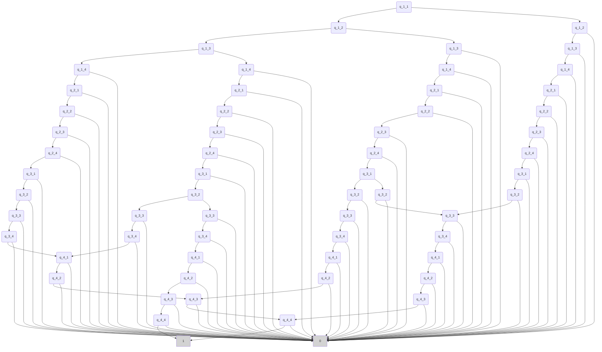

```mermaid
%%{ init: {"theme": "default"} }%%
graph TB
  node000("q_1_1")
  node001("q_1_2")
  node002("q_1_2")
  node003("q_1_3")
  node004("q_1_3")
  node005("q_1_3")
  node006("q_1_4")
  node007("q_1_4")
  node008("q_1_4")
  node009("q_1_4")
  node010("q_2_1")
  node011("q_2_1")
  node012("q_2_1")
  node013("q_2_1")
  node014("q_2_2")
  node015("q_2_2")
  node016("q_2_2")
  node017("q_2_2")
  node018("q_2_3")
  node019("q_2_3")
  node020("q_2_3")
  node021("q_2_3")
  node022("q_2_4")
  node023("q_2_4")
  node024("q_2_4")
  node025("q_2_4")
  node026("q_3_1")
  node027("q_3_1")
  node028("q_3_1")
  node029("q_3_1")
  node030("q_3_2")
  node031("q_3_2")
  node032("q_3_2")
  node033("q_3_2")
  node034("q_3_2")
  node035("q_3_3")
  node036("q_3_3")
  node037("q_3_3")
  node038("q_3_3")
  node039("q_3_3")
  node040("q_3_4")
  node041("q_3_4")
  node042("q_3_4")
  node043("q_3_4")
  node044("q_3_4")
  node045("q_4_1")
  node046("q_4_1")
  node047("q_4_1")
  node048("q_4_1")
  node049("q_4_2")
  node050("q_4_2")
  node051("q_4_2")
  node052("q_4_2")
  node053("q_4_3")
  node054("q_4_3")
  node055("q_4_3")
  node056("q_4_4")
  node057("q_4_4")
  node058["1"]
  style node058 fill:lightgray
  node059["0"]
  style node059 fill:lightgray
  node000 --> node001
  node000 --> node002
  node001 --> node003
  node001 --> node004
  node002 --> node005
  node002 --> node059
  node003 --> node006
  node003 --> node007
  node004 --> node008
  node004 --> node059
  node005 --> node009
  node005 --> node059
  node006 --> node010
  node006 --> node059
  node007 --> node011
  node007 --> node059
  node008 --> node012
  node008 --> node059
  node009 --> node013
  node009 --> node059
  node010 --> node014
  node010 --> node059
  node011 --> node015
  node011 --> node059
  node012 --> node016
  node012 --> node059
  node013 --> node017
  node013 --> node059
  node014 --> node018
  node014 --> node059
  node015 --> node019
  node015 --> node059
  node016 --> node020
  node016 --> node059
  node017 --> node021
  node017 --> node059
  node018 --> node022
  node018 --> node059
  node019 --> node023
  node019 --> node059
  node020 --> node024
  node020 --> node059
  node021 --> node025
  node021 --> node059
  node022 --> node026
  node022 --> node059
  node023 --> node027
  node023 --> node059
  node024 --> node028
  node024 --> node059
  node025 --> node029
  node025 --> node059
  node026 --> node030
  node026 --> node059
  node027 --> node031
  node027 --> node059
  node028 --> node032
  node028 --> node033
  node029 --> node034
  node029 --> node059
  node030 --> node035
  node030 --> node059
  node031 --> node036
  node031 --> node037
  node032 --> node038
  node032 --> node059
  node033 --> node039
  node033 --> node059
  node034 --> node039
  node034 --> node059
  node035 --> node040
  node035 --> node059
  node036 --> node041
  node036 --> node059
  node037 --> node042
  node037 --> node059
  node038 --> node043
  node038 --> node059
  node039 --> node044
  node039 --> node059
  node040 --> node045
  node040 --> node059
  node041 --> node045
  node041 --> node059
  node042 --> node046
  node042 --> node059
  node043 --> node047
  node043 --> node059
  node044 --> node048
  node044 --> node059
  node045 --> node049
  node045 --> node059
  node046 --> node050
  node046 --> node059
  node047 --> node051
  node047 --> node059
  node048 --> node052
  node048 --> node059
  node049 --> node054
  node049 --> node059
  node050 --> node053
  node050 --> node059
  node051 --> node054
  node051 --> node059
  node052 --> node055
  node052 --> node059
  node053 --> node056
  node053 --> node059
  node054 --> node057
  node054 --> node059
  node055 --> node057
  node055 --> node059
  node056 --> node058
  node056 --> node059
  node057 --> node058
  node057 --> node059
```
