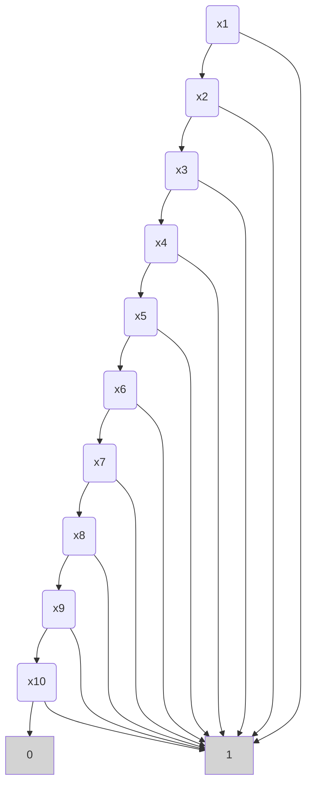

```mermaid
%%{ init: {"theme": "default"} }%%
graph TB
  node000("x1")
  node001("x2")
  node002("x3")
  node003("x4")
  node004("x5")
  node005("x6")
  node006("x7")
  node007("x8")
  node008("x9")
  node009("x10")
  node010["0"]
  style node010 fill:lightgray
  node011["1"]
  style node011 fill:lightgray
  node000 --> node001
  node000 --> node011
  node001 --> node002
  node001 --> node011
  node002 --> node003
  node002 --> node011
  node003 --> node004
  node003 --> node011
  node004 --> node005
  node004 --> node011
  node005 --> node006
  node005 --> node011
  node006 --> node007
  node006 --> node011
  node007 --> node008
  node007 --> node011
  node008 --> node009
  node008 --> node011
  node009 --> node010
  node009 --> node011
```
