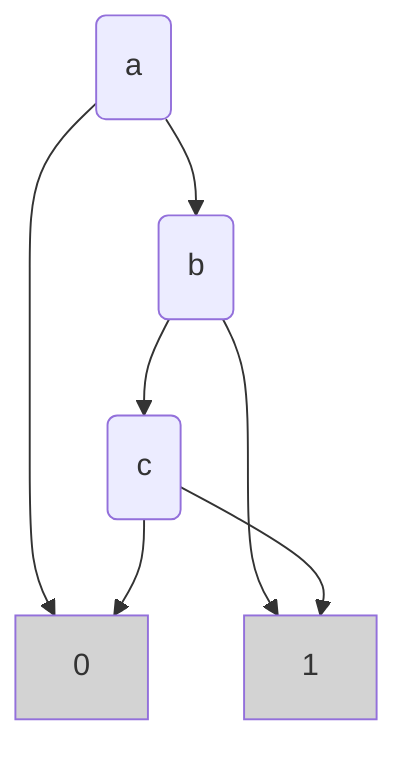

```mermaid
graph TB
  a("a")
  b("b")
  c("c")
  node4["0"]
  style node4 fill:lightgray
  node5["1"]
  style node5 fill:lightgray
  a --> b
  a --> node4
  b --> c
  b --> node5
  c --> node4
  c --> node5
```
