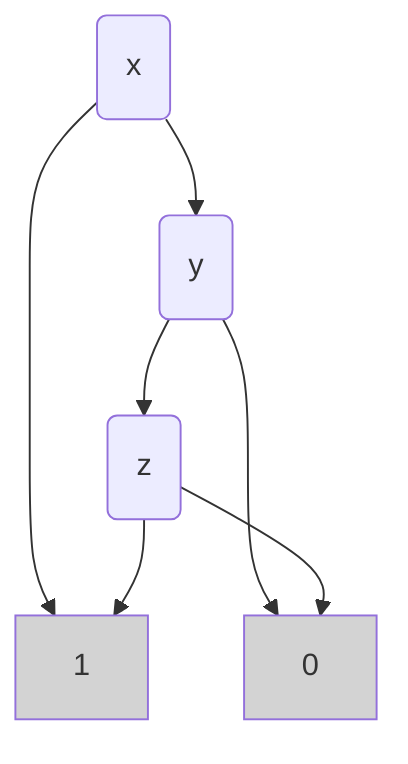

```mermaid
graph TB
  node000("x")
  node001("y")
  node002("z")
  node003["1"]
  style node003 fill:lightgray
  node004["0"]
  style node004 fill:lightgray
  node000 --> node001
  node000 --> node003
  node001 --> node002
  node001 --> node004
  node002 --> node003
  node002 --> node004
```
