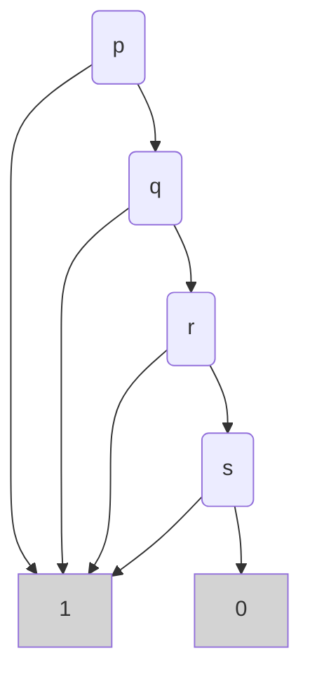

```mermaid
graph TB
  node5["0"]
  style node5 fill:lightgray
  node6["1"]
  style node6 fill:lightgray
  p("p")
  q("q")
  r("r")
  s("s")
  p --> node6
  p --> q
  q --> node6
  q --> r
  r --> node6
  r --> s
  s --> node5
  s --> node6
```
