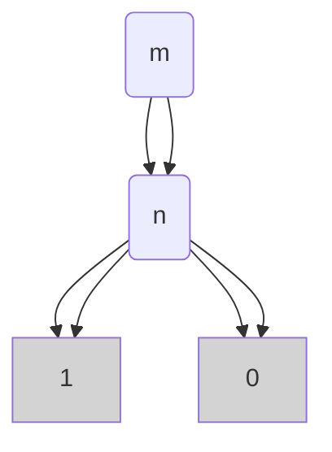

```mermaid
graph TB
  m("m")
  n("n")
  n("n")
  node4["1"]
  style node4 fill:lightgray
  node5["0"]
  style node5 fill:lightgray
  m --> n
  m --> n
  n --> node4
  n --> node4
  n --> node5
  n --> node5
```
