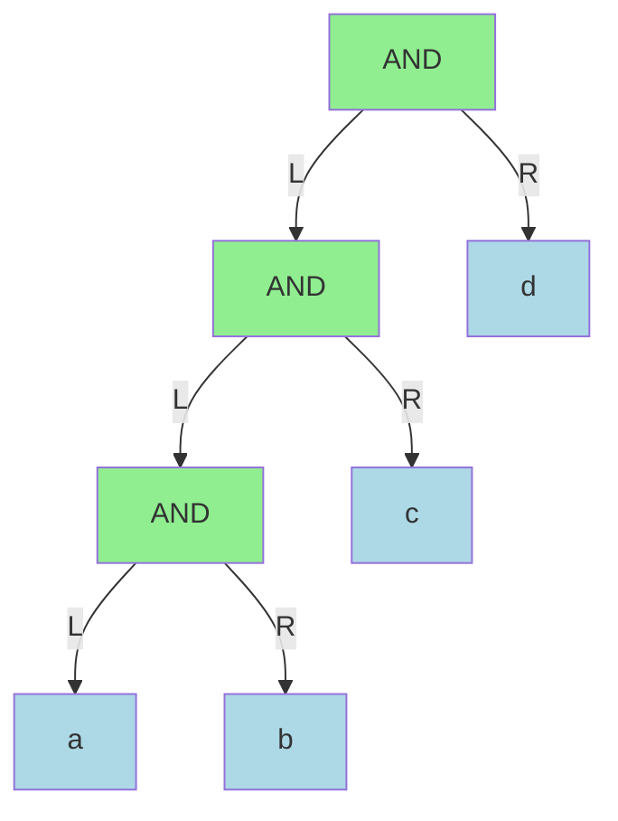

```mermaid
graph TB
  node1["AND"]
  style node1 fill:lightgreen
  node2["AND"]
  style node2 fill:lightgreen
  node3["d"]
  style node3 fill:lightblue
  node4["AND"]
  style node4 fill:lightgreen
  node5["c"]
  style node5 fill:lightblue
  node6["a"]
  style node6 fill:lightblue
  node7["b"]
  style node7 fill:lightblue
  node1 -- "L" --> node2
  node1 -- "R" --> node3
  node2 -- "L" --> node4
  node2 -- "R" --> node5
  node4 -- "L" --> node6
  node4 -- "R" --> node7
```
