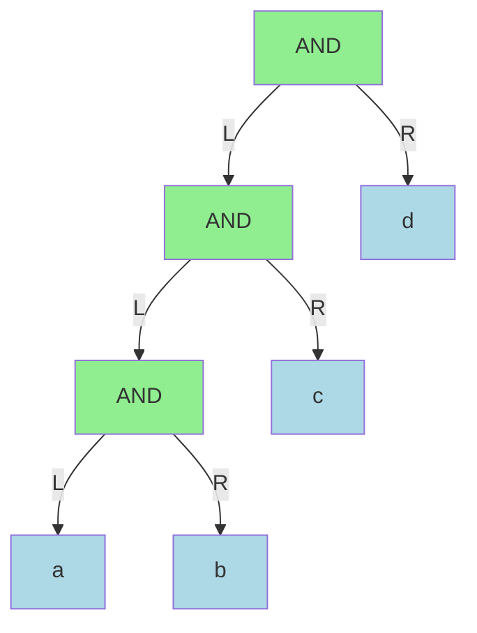

```mermaid
graph TB
  node000["AND"]
  style node000 fill:lightgreen
  node001["AND"]
  style node001 fill:lightgreen
  node002["d"]
  style node002 fill:lightblue
  node003["AND"]
  style node003 fill:lightgreen
  node004["c"]
  style node004 fill:lightblue
  node005["a"]
  style node005 fill:lightblue
  node006["b"]
  style node006 fill:lightblue
  node000 -- "L" --> node001
  node000 -- "R" --> node002
  node001 -- "L" --> node003
  node001 -- "R" --> node004
  node003 -- "L" --> node005
  node003 -- "R" --> node006
```
