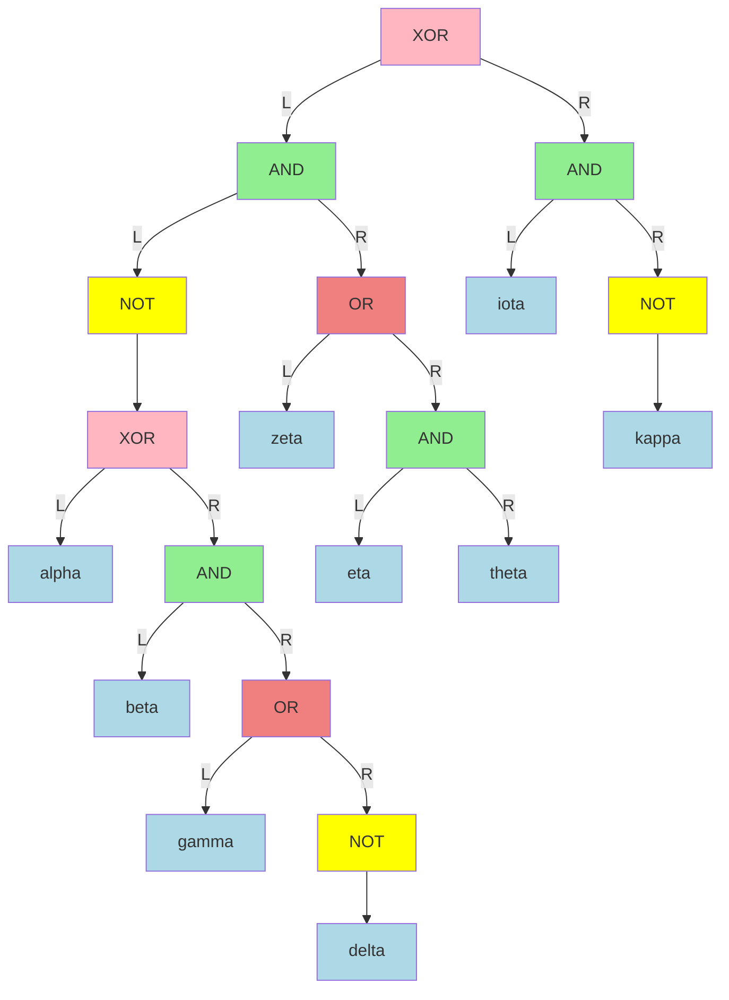

```mermaid
graph TB
  node1["XOR"]
  style node1 fill:lightpink
  node2["AND"]
  style node2 fill:lightgreen
  node3["AND"]
  style node3 fill:lightgreen
  node4["NOT"]
  style node4 fill:yellow
  node5["OR"]
  style node5 fill:lightcoral
  node6["iota"]
  style node6 fill:lightblue
  node7["NOT"]
  style node7 fill:yellow
  node8["XOR"]
  style node8 fill:lightpink
  node9["zeta"]
  style node9 fill:lightblue
  node10["AND"]
  style node10 fill:lightgreen
  node11["kappa"]
  style node11 fill:lightblue
  node12["alpha"]
  style node12 fill:lightblue
  node13["AND"]
  style node13 fill:lightgreen
  node14["eta"]
  style node14 fill:lightblue
  node15["theta"]
  style node15 fill:lightblue
  node16["beta"]
  style node16 fill:lightblue
  node17["OR"]
  style node17 fill:lightcoral
  node18["gamma"]
  style node18 fill:lightblue
  node19["NOT"]
  style node19 fill:yellow
  node20["delta"]
  style node20 fill:lightblue
  node1 -- "L" --> node2
  node1 -- "R" --> node3
  node2 -- "L" --> node4
  node2 -- "R" --> node5
  node3 -- "L" --> node6
  node3 -- "R" --> node7
  node4 --> node8
  node5 -- "L" --> node9
  node5 -- "R" --> node10
  node7 --> node11
  node8 -- "L" --> node12
  node8 -- "R" --> node13
  node10 -- "L" --> node14
  node10 -- "R" --> node15
  node13 -- "L" --> node16
  node13 -- "R" --> node17
  node17 -- "L" --> node18
  node17 -- "R" --> node19
  node19 --> node20
```
