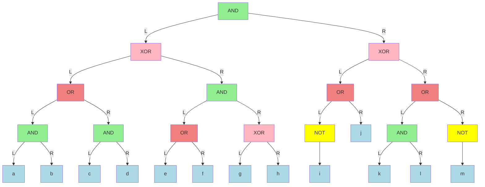

```mermaid
%%{ init: {"theme": "default"} }%%
graph TB
  node000["AND"]
  style node000 fill:lightgreen
  node001["XOR"]
  style node001 fill:lightpink
  node002["XOR"]
  style node002 fill:lightpink
  node003["OR"]
  style node003 fill:lightcoral
  node004["AND"]
  style node004 fill:lightgreen
  node005["OR"]
  style node005 fill:lightcoral
  node006["OR"]
  style node006 fill:lightcoral
  node007["AND"]
  style node007 fill:lightgreen
  node008["AND"]
  style node008 fill:lightgreen
  node009["OR"]
  style node009 fill:lightcoral
  node010["XOR"]
  style node010 fill:lightpink
  node011["NOT"]
  style node011 fill:yellow
  node012["j"]
  style node012 fill:lightblue
  node013["AND"]
  style node013 fill:lightgreen
  node014["NOT"]
  style node014 fill:yellow
  node015["a"]
  style node015 fill:lightblue
  node016["b"]
  style node016 fill:lightblue
  node017["c"]
  style node017 fill:lightblue
  node018["d"]
  style node018 fill:lightblue
  node019["e"]
  style node019 fill:lightblue
  node020["f"]
  style node020 fill:lightblue
  node021["g"]
  style node021 fill:lightblue
  node022["h"]
  style node022 fill:lightblue
  node023["i"]
  style node023 fill:lightblue
  node024["k"]
  style node024 fill:lightblue
  node025["l"]
  style node025 fill:lightblue
  node026["m"]
  style node026 fill:lightblue
  node000 -- "L" --> node001
  node000 -- "R" --> node002
  node001 -- "L" --> node003
  node001 -- "R" --> node004
  node002 -- "L" --> node005
  node002 -- "R" --> node006
  node003 -- "L" --> node007
  node003 -- "R" --> node008
  node004 -- "L" --> node009
  node004 -- "R" --> node010
  node005 -- "L" --> node011
  node005 -- "R" --> node012
  node006 -- "L" --> node013
  node006 -- "R" --> node014
  node007 -- "L" --> node015
  node007 -- "R" --> node016
  node008 -- "L" --> node017
  node008 -- "R" --> node018
  node009 -- "L" --> node019
  node009 -- "R" --> node020
  node010 -- "L" --> node021
  node010 -- "R" --> node022
  node011 --> node023
  node013 -- "L" --> node024
  node013 -- "R" --> node025
  node014 --> node026
```
