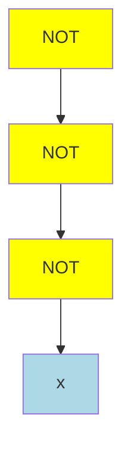

```mermaid
%%{ init: {"theme": "default"} }%%
graph TB
  node000["NOT"]
  style node000 fill:yellow
  node001["NOT"]
  style node001 fill:yellow
  node002["NOT"]
  style node002 fill:yellow
  node003["x"]
  style node003 fill:lightblue
  node000 --> node001
  node001 --> node002
  node002 --> node003
```
