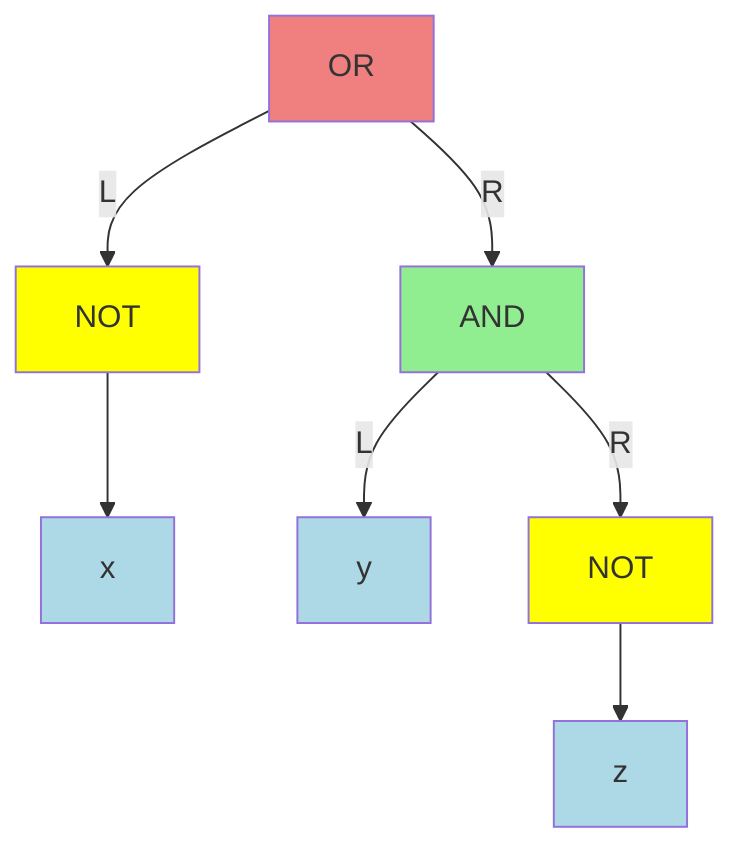

```mermaid
graph TB
  node1["OR"]
  style node1 fill:lightcoral
  node2["NOT"]
  style node2 fill:yellow
  node3["AND"]
  style node3 fill:lightgreen
  node4["x"]
  style node4 fill:lightblue
  node5["y"]
  style node5 fill:lightblue
  node6["NOT"]
  style node6 fill:yellow
  node7["z"]
  style node7 fill:lightblue
  node1 -- "L" --> node2
  node1 -- "R" --> node3
  node2 --> node4
  node3 -- "L" --> node5
  node3 -- "R" --> node6
  node6 --> node7
```
