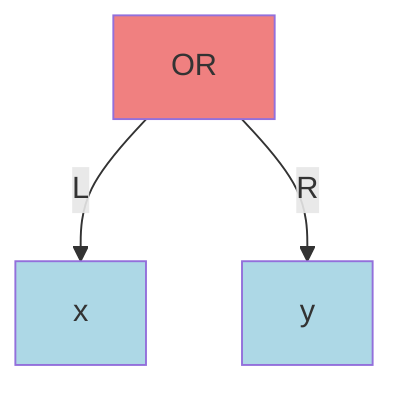

```mermaid
graph TB
  node1["OR"]
  style node1 fill:lightcoral
  node2["x"]
  style node2 fill:lightblue
  node3["y"]
  style node3 fill:lightblue
  node1 -- "L" --> node2
  node1 -- "R" --> node3
```
