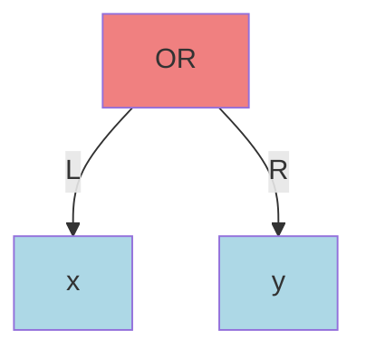

```mermaid
graph TB
  node000["OR"]
  style node000 fill:lightcoral
  node001["x"]
  style node001 fill:lightblue
  node002["y"]
  style node002 fill:lightblue
  node000 -- "L" --> node001
  node000 -- "R" --> node002
```
