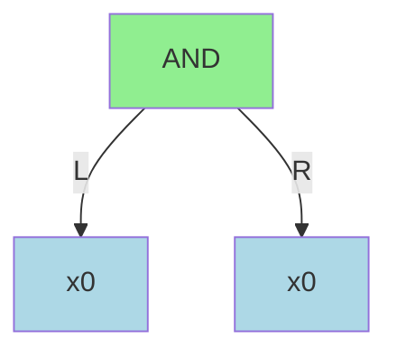

```mermaid
%%{ init: {"theme": "default"} }%%
graph TB
  node000["AND"]
  style node000 fill:lightgreen
  node001["x0"]
  style node001 fill:lightblue
  node002["x0"]
  style node002 fill:lightblue
  node000 -- "L" --> node001
  node000 -- "R" --> node002
```
