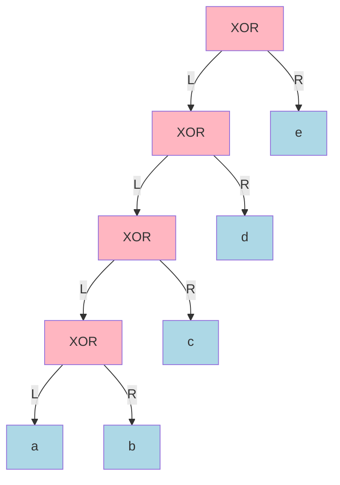

```mermaid
%%{ init: {"theme": "default"} }%%
graph TB
  node000["XOR"]
  style node000 fill:lightpink
  node001["XOR"]
  style node001 fill:lightpink
  node002["e"]
  style node002 fill:lightblue
  node003["XOR"]
  style node003 fill:lightpink
  node004["d"]
  style node004 fill:lightblue
  node005["XOR"]
  style node005 fill:lightpink
  node006["c"]
  style node006 fill:lightblue
  node007["a"]
  style node007 fill:lightblue
  node008["b"]
  style node008 fill:lightblue
  node000 -- "L" --> node001
  node000 -- "R" --> node002
  node001 -- "L" --> node003
  node001 -- "R" --> node004
  node003 -- "L" --> node005
  node003 -- "R" --> node006
  node005 -- "L" --> node007
  node005 -- "R" --> node008
```
