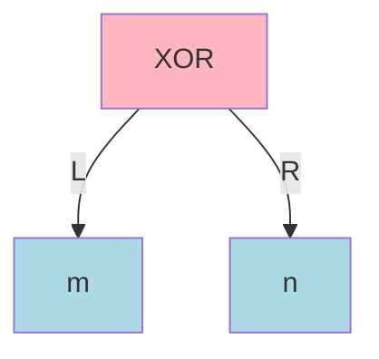

```mermaid
graph TB
  node000["XOR"]
  style node000 fill:lightpink
  node001["m"]
  style node001 fill:lightblue
  node002["n"]
  style node002 fill:lightblue
  node000 -- "L" --> node001
  node000 -- "R" --> node002
```
