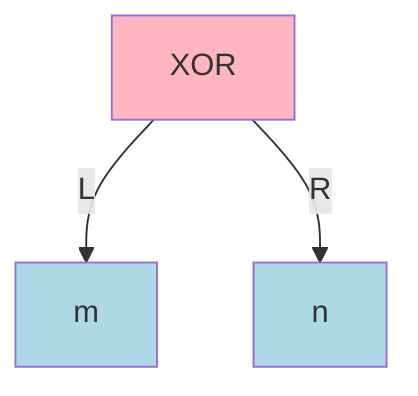

```mermaid
graph TB
  node1["XOR"]
  style node1 fill:lightpink
  node2["m"]
  style node2 fill:lightblue
  node3["n"]
  style node3 fill:lightblue
  node1 -- "L" --> node2
  node1 -- "R" --> node3
```
