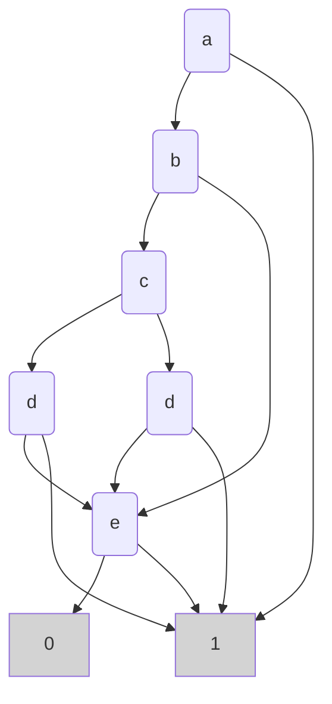

```mermaid
%%{ init: {"theme": "default"} }%%
graph TB
  node000("a")
  node001("b")
  node002("c")
  node003("d")
  node004("d")
  node005("e")
  node006["0"]
  style node006 fill:lightgray
  node007["1"]
  style node007 fill:lightgray
  node000 --> node001
  node000 --> node007
  node001 --> node002
  node001 --> node005
  node002 --> node003
  node002 --> node004
  node003 --> node005
  node003 --> node007
  node004 --> node005
  node004 --> node007
  node005 --> node006
  node005 --> node007
```
