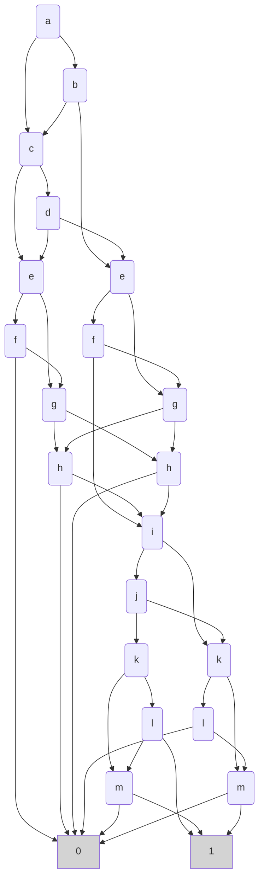

```mermaid
%%{ init: {"theme": "default"} }%%
graph TB
  node000("a")
  node001("b")
  node002("c")
  node003("d")
  node004("e")
  node005("e")
  node006("f")
  node007("f")
  node008("g")
  node009("g")
  node010("h")
  node011("h")
  node012("i")
  node013("j")
  node014("k")
  node015("k")
  node016("l")
  node017("l")
  node018("m")
  node019("m")
  node020["0"]
  style node020 fill:lightgray
  node021["1"]
  style node021 fill:lightgray
  node000 --> node001
  node000 --> node002
  node001 --> node002
  node001 --> node005
  node002 --> node003
  node002 --> node004
  node003 --> node004
  node003 --> node005
  node004 --> node006
  node004 --> node008
  node005 --> node007
  node005 --> node009
  node006 --> node008
  node006 --> node020
  node007 --> node009
  node007 --> node012
  node008 --> node010
  node008 --> node011
  node009 --> node010
  node009 --> node011
  node010 --> node012
  node010 --> node020
  node011 --> node012
  node011 --> node020
  node012 --> node013
  node012 --> node015
  node013 --> node014
  node013 --> node015
  node014 --> node016
  node014 --> node018
  node015 --> node017
  node015 --> node019
  node016 --> node018
  node016 --> node021
  node017 --> node019
  node017 --> node020
  node018 --> node020
  node018 --> node021
  node019 --> node020
  node019 --> node021
```
