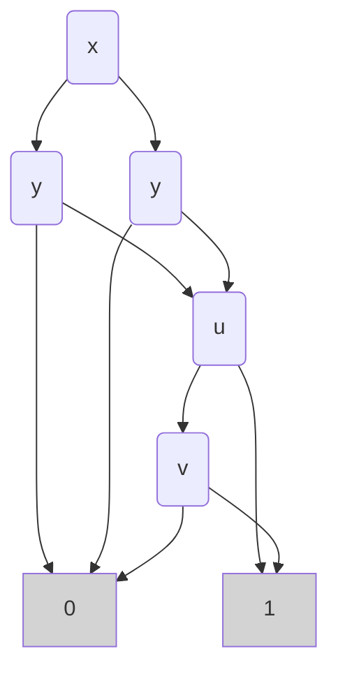

```mermaid
%%{ init: {"theme": "default"} }%%
graph TB
  node000("x")
  node001("y")
  node002("y")
  node003("u")
  node004("v")
  node005["0"]
  style node005 fill:lightgray
  node006["1"]
  style node006 fill:lightgray
  node000 --> node001
  node000 --> node002
  node001 --> node003
  node001 --> node005
  node002 --> node003
  node002 --> node005
  node003 --> node004
  node003 --> node006
  node004 --> node005
  node004 --> node006
```
