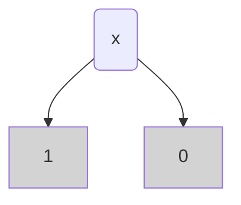

```mermaid
%%{ init: {"theme": "default"} }%%
graph TB
  node000("x")
  node001["1"]
  style node001 fill:lightgray
  node002["0"]
  style node002 fill:lightgray
  node000 --> node001
  node000 --> node002
```
