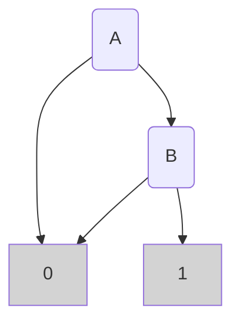

```mermaid
%%{ init: {"theme": "default"} }%%
graph TB
  node000("A")
  node001("B")
  node002["0"]
  style node002 fill:lightgray
  node003["1"]
  style node003 fill:lightgray
  node000 --> node001
  node000 --> node002
  node001 --> node002
  node001 --> node003
```
