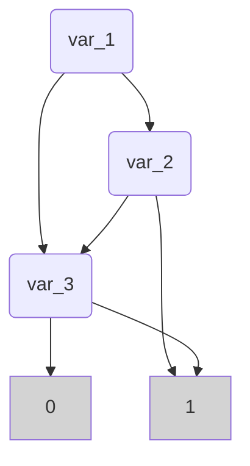

```mermaid
%%{ init: {"theme": "default"} }%%
graph TB
  node000("var_1")
  node001("var_2")
  node002("var_3")
  node003["0"]
  style node003 fill:lightgray
  node004["1"]
  style node004 fill:lightgray
  node000 --> node001
  node000 --> node002
  node001 --> node002
  node001 --> node004
  node002 --> node003
  node002 --> node004
```
