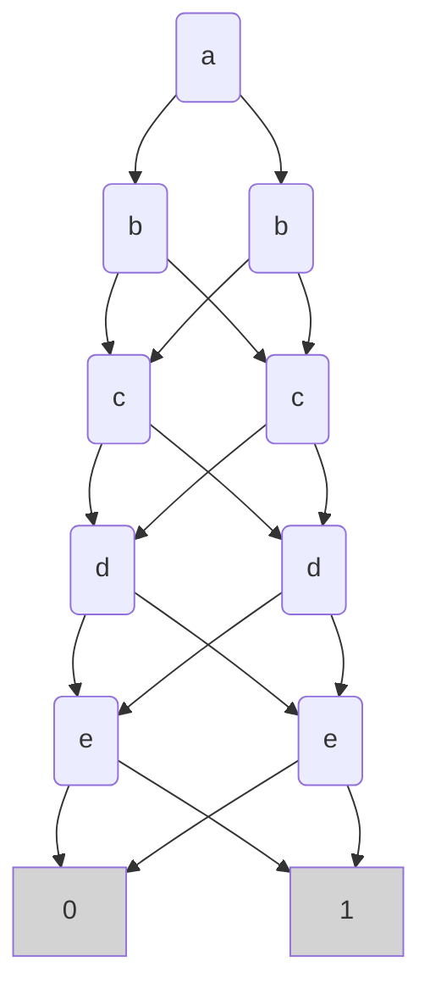

```mermaid
%%{ init: {"theme": "default"} }%%
graph TB
  node000("a")
  node001("b")
  node002("b")
  node003("c")
  node004("c")
  node005("d")
  node006("d")
  node007("e")
  node008("e")
  node009["0"]
  style node009 fill:lightgray
  node010["1"]
  style node010 fill:lightgray
  node000 --> node001
  node000 --> node002
  node001 --> node003
  node001 --> node004
  node002 --> node003
  node002 --> node004
  node003 --> node005
  node003 --> node006
  node004 --> node005
  node004 --> node006
  node005 --> node007
  node005 --> node008
  node006 --> node007
  node006 --> node008
  node007 --> node009
  node007 --> node010
  node008 --> node009
  node008 --> node010
```
