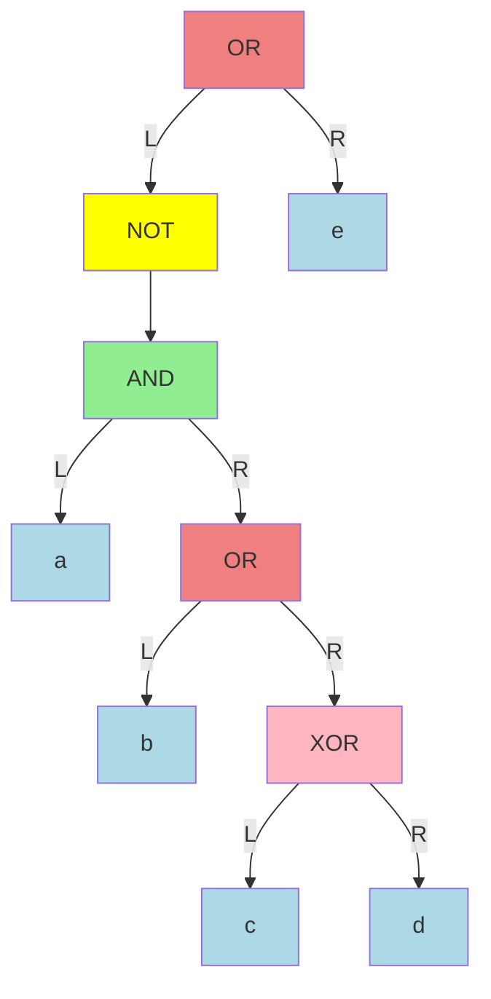

```mermaid
%%{ init: {"theme": "default"} }%%
graph TB
  node000["OR"]
  style node000 fill:lightcoral
  node001["NOT"]
  style node001 fill:yellow
  node002["e"]
  style node002 fill:lightblue
  node003["AND"]
  style node003 fill:lightgreen
  node004["a"]
  style node004 fill:lightblue
  node005["OR"]
  style node005 fill:lightcoral
  node006["b"]
  style node006 fill:lightblue
  node007["XOR"]
  style node007 fill:lightpink
  node008["c"]
  style node008 fill:lightblue
  node009["d"]
  style node009 fill:lightblue
  node000 -- "L" --> node001
  node000 -- "R" --> node002
  node001 --> node003
  node003 -- "L" --> node004
  node003 -- "R" --> node005
  node005 -- "L" --> node006
  node005 -- "R" --> node007
  node007 -- "L" --> node008
  node007 -- "R" --> node009
```
