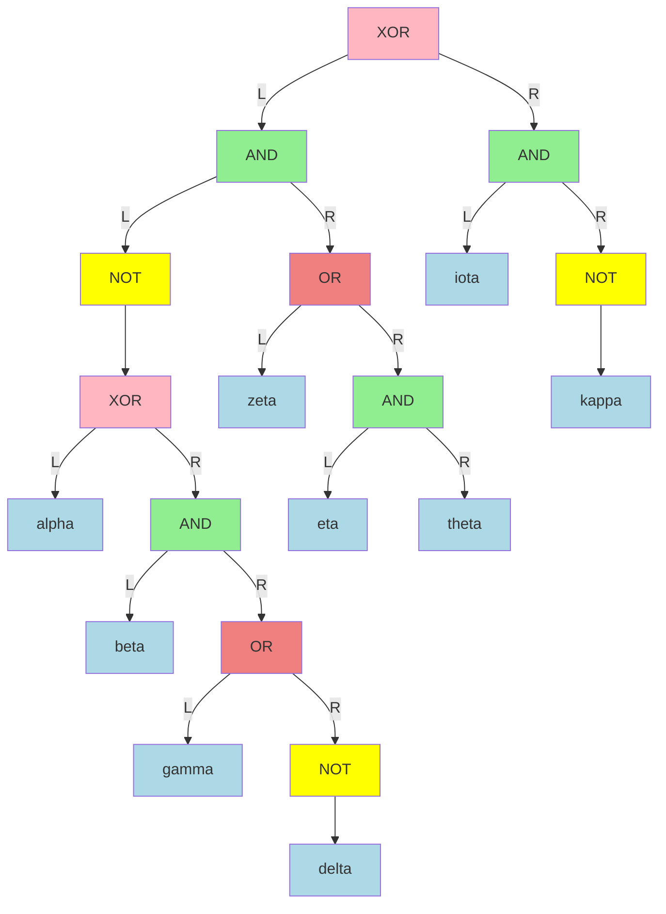

```mermaid
%%{ init: {"theme": "default"} }%%
graph TB
  node000["XOR"]
  style node000 fill:lightpink
  node001["AND"]
  style node001 fill:lightgreen
  node002["AND"]
  style node002 fill:lightgreen
  node003["NOT"]
  style node003 fill:yellow
  node004["OR"]
  style node004 fill:lightcoral
  node005["iota"]
  style node005 fill:lightblue
  node006["NOT"]
  style node006 fill:yellow
  node007["XOR"]
  style node007 fill:lightpink
  node008["zeta"]
  style node008 fill:lightblue
  node009["AND"]
  style node009 fill:lightgreen
  node010["kappa"]
  style node010 fill:lightblue
  node011["alpha"]
  style node011 fill:lightblue
  node012["AND"]
  style node012 fill:lightgreen
  node013["eta"]
  style node013 fill:lightblue
  node014["theta"]
  style node014 fill:lightblue
  node015["beta"]
  style node015 fill:lightblue
  node016["OR"]
  style node016 fill:lightcoral
  node017["gamma"]
  style node017 fill:lightblue
  node018["NOT"]
  style node018 fill:yellow
  node019["delta"]
  style node019 fill:lightblue
  node000 -- "L" --> node001
  node000 -- "R" --> node002
  node001 -- "L" --> node003
  node001 -- "R" --> node004
  node002 -- "L" --> node005
  node002 -- "R" --> node006
  node003 --> node007
  node004 -- "L" --> node008
  node004 -- "R" --> node009
  node006 --> node010
  node007 -- "L" --> node011
  node007 -- "R" --> node012
  node009 -- "L" --> node013
  node009 -- "R" --> node014
  node012 -- "L" --> node015
  node012 -- "R" --> node016
  node016 -- "L" --> node017
  node016 -- "R" --> node018
  node018 --> node019
```
