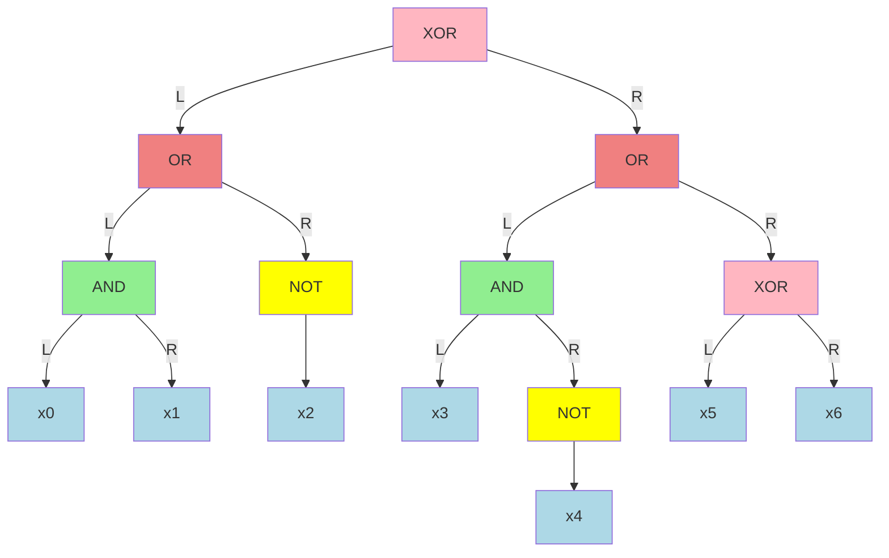

```mermaid
%%{ init: {"theme": "default"} }%%
graph TB
  node000["XOR"]
  style node000 fill:lightpink
  node001["OR"]
  style node001 fill:lightcoral
  node002["OR"]
  style node002 fill:lightcoral
  node003["AND"]
  style node003 fill:lightgreen
  node004["NOT"]
  style node004 fill:yellow
  node005["AND"]
  style node005 fill:lightgreen
  node006["XOR"]
  style node006 fill:lightpink
  node007["x0"]
  style node007 fill:lightblue
  node008["x1"]
  style node008 fill:lightblue
  node009["x2"]
  style node009 fill:lightblue
  node010["x3"]
  style node010 fill:lightblue
  node011["NOT"]
  style node011 fill:yellow
  node012["x5"]
  style node012 fill:lightblue
  node013["x6"]
  style node013 fill:lightblue
  node014["x4"]
  style node014 fill:lightblue
  node000 -- "L" --> node001
  node000 -- "R" --> node002
  node001 -- "L" --> node003
  node001 -- "R" --> node004
  node002 -- "L" --> node005
  node002 -- "R" --> node006
  node003 -- "L" --> node007
  node003 -- "R" --> node008
  node004 --> node009
  node005 -- "L" --> node010
  node005 -- "R" --> node011
  node006 -- "L" --> node012
  node006 -- "R" --> node013
  node011 --> node014
```
