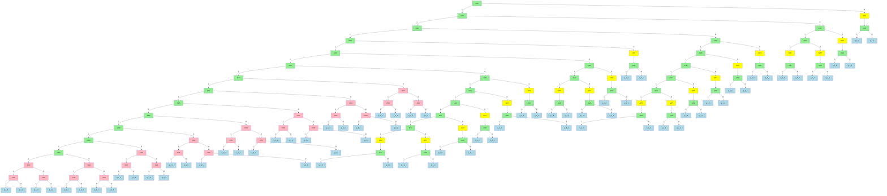

```mermaid
%%{ init: {"theme": "default"} }%%
graph TB
  node000["AND"]
  style node000 fill:lightgreen
  node001["AND"]
  style node001 fill:lightgreen
  node002["NOT"]
  style node002 fill:yellow
  node003["AND"]
  style node003 fill:lightgreen
  node004["AND"]
  style node004 fill:lightgreen
  node005["AND"]
  style node005 fill:lightgreen
  node006["AND"]
  style node006 fill:lightgreen
  node007["AND"]
  style node007 fill:lightgreen
  node008["AND"]
  style node008 fill:lightgreen
  node009["NOT"]
  style node009 fill:yellow
  node010["q_1_2"]
  style node010 fill:lightblue
  node011["q_2_1"]
  style node011 fill:lightblue
  node012["AND"]
  style node012 fill:lightgreen
  node013["NOT"]
  style node013 fill:yellow
  node014["AND"]
  style node014 fill:lightgreen
  node015["NOT"]
  style node015 fill:yellow
  node016["NOT"]
  style node016 fill:yellow
  node017["NOT"]
  style node017 fill:yellow
  node018["AND"]
  style node018 fill:lightgreen
  node019["AND"]
  style node019 fill:lightgreen
  node020["AND"]
  style node020 fill:lightgreen
  node021["AND"]
  style node021 fill:lightgreen
  node022["AND"]
  style node022 fill:lightgreen
  node023["NOT"]
  style node023 fill:yellow
  node024["AND"]
  style node024 fill:lightgreen
  node025["AND"]
  style node025 fill:lightgreen
  node026["AND"]
  style node026 fill:lightgreen
  node027["q_2_2"]
  style node027 fill:lightblue
  node028["q_3_1"]
  style node028 fill:lightblue
  node029["AND"]
  style node029 fill:lightgreen
  node030["AND"]
  style node030 fill:lightgreen
  node031["AND"]
  style node031 fill:lightgreen
  node032["NOT"]
  style node032 fill:yellow
  node033["q_1_3"]
  style node033 fill:lightblue
  node034["q_2_4"]
  style node034 fill:lightblue
  node035["AND"]
  style node035 fill:lightgreen
  node036["NOT"]
  style node036 fill:yellow
  node037["AND"]
  style node037 fill:lightgreen
  node038["q_3_2"]
  style node038 fill:lightblue
  node039["q_4_1"]
  style node039 fill:lightblue
  node040["q_1_3"]
  style node040 fill:lightblue
  node041["q_2_2"]
  style node041 fill:lightblue
  node042["q_1_3"]
  style node042 fill:lightblue
  node043["q_3_1"]
  style node043 fill:lightblue
  node044["AND"]
  style node044 fill:lightgreen
  node045["XOR"]
  style node045 fill:lightpink
  node046["AND"]
  style node046 fill:lightgreen
  node047["NOT"]
  style node047 fill:yellow
  node048["NOT"]
  style node048 fill:yellow
  node049["NOT"]
  style node049 fill:yellow
  node050["AND"]
  style node050 fill:lightgreen
  node051["AND"]
  style node051 fill:lightgreen
  node052["NOT"]
  style node052 fill:yellow
  node053["AND"]
  style node053 fill:lightgreen
  node054["q_2_3"]
  style node054 fill:lightblue
  node055["q_4_1"]
  style node055 fill:lightblue
  node056["AND"]
  style node056 fill:lightgreen
  node057["XOR"]
  style node057 fill:lightpink
  node058["XOR"]
  style node058 fill:lightpink
  node059["XOR"]
  style node059 fill:lightpink
  node060["AND"]
  style node060 fill:lightgreen
  node061["NOT"]
  style node061 fill:yellow
  node062["AND"]
  style node062 fill:lightgreen
  node063["AND"]
  style node063 fill:lightgreen
  node064["AND"]
  style node064 fill:lightgreen
  node065["q_2_3"]
  style node065 fill:lightblue
  node066["q_3_4"]
  style node066 fill:lightblue
  node067["NOT"]
  style node067 fill:yellow
  node068["NOT"]
  style node068 fill:yellow
  node069["AND"]
  style node069 fill:lightgreen
  node070["q_2_3"]
  style node070 fill:lightblue
  node071["q_3_2"]
  style node071 fill:lightblue
  node072["AND"]
  style node072 fill:lightgreen
  node073["XOR"]
  style node073 fill:lightpink
  node074["XOR"]
  style node074 fill:lightpink
  node075["XOR"]
  style node075 fill:lightpink
  node076["q_1_4"]
  style node076 fill:lightblue
  node077["q_2_4"]
  style node077 fill:lightblue
  node078["q_3_4"]
  style node078 fill:lightblue
  node079["q_4_4"]
  style node079 fill:lightblue
  node080["AND"]
  style node080 fill:lightgreen
  node081["NOT"]
  style node081 fill:yellow
  node082["AND"]
  style node082 fill:lightgreen
  node083["q_3_3"]
  style node083 fill:lightblue
  node084["q_4_4"]
  style node084 fill:lightblue
  node085["q_1_2"]
  style node085 fill:lightblue
  node086["q_2_3"]
  style node086 fill:lightblue
  node087["q_1_2"]
  style node087 fill:lightblue
  node088["q_3_4"]
  style node088 fill:lightblue
  node089["AND"]
  style node089 fill:lightgreen
  node090["AND"]
  style node090 fill:lightgreen
  node091["q_1_4"]
  style node091 fill:lightblue
  node092["q_4_1"]
  style node092 fill:lightblue
  node093["AND"]
  style node093 fill:lightgreen
  node094["XOR"]
  style node094 fill:lightpink
  node095["XOR"]
  style node095 fill:lightpink
  node096["XOR"]
  style node096 fill:lightpink
  node097["q_1_3"]
  style node097 fill:lightblue
  node098["q_2_3"]
  style node098 fill:lightblue
  node099["q_3_3"]
  style node099 fill:lightblue
  node100["q_4_3"]
  style node100 fill:lightblue
  node101["AND"]
  style node101 fill:lightgreen
  node102["NOT"]
  style node102 fill:yellow
  node103["AND"]
  style node103 fill:lightgreen
  node104["q_2_2"]
  style node104 fill:lightblue
  node105["q_4_4"]
  style node105 fill:lightblue
  node106["q_1_4"]
  style node106 fill:lightblue
  node107["q_2_3"]
  style node107 fill:lightblue
  node108["q_1_4"]
  style node108 fill:lightblue
  node109["q_3_2"]
  style node109 fill:lightblue
  node110["AND"]
  style node110 fill:lightgreen
  node111["XOR"]
  style node111 fill:lightpink
  node112["XOR"]
  style node112 fill:lightpink
  node113["XOR"]
  style node113 fill:lightpink
  node114["q_1_2"]
  style node114 fill:lightblue
  node115["q_2_2"]
  style node115 fill:lightblue
  node116["q_3_2"]
  style node116 fill:lightblue
  node117["q_4_2"]
  style node117 fill:lightblue
  node118["NOT"]
  style node118 fill:yellow
  node119["NOT"]
  style node119 fill:yellow
  node120["AND"]
  style node120 fill:lightgreen
  node121["q_2_2"]
  style node121 fill:lightblue
  node122["q_3_3"]
  style node122 fill:lightblue
  node123["AND"]
  style node123 fill:lightgreen
  node124["XOR"]
  style node124 fill:lightpink
  node125["XOR"]
  style node125 fill:lightpink
  node126["XOR"]
  style node126 fill:lightpink
  node127["q_1_1"]
  style node127 fill:lightblue
  node128["q_2_1"]
  style node128 fill:lightblue
  node129["q_3_1"]
  style node129 fill:lightblue
  node130["q_4_1"]
  style node130 fill:lightblue
  node131["AND"]
  style node131 fill:lightgreen
  node132["AND"]
  style node132 fill:lightgreen
  node133["q_1_1"]
  style node133 fill:lightblue
  node134["q_4_4"]
  style node134 fill:lightblue
  node135["XOR"]
  style node135 fill:lightpink
  node136["XOR"]
  style node136 fill:lightpink
  node137["XOR"]
  style node137 fill:lightpink
  node138["XOR"]
  style node138 fill:lightpink
  node139["q_4_1"]
  style node139 fill:lightblue
  node140["q_4_2"]
  style node140 fill:lightblue
  node141["q_4_3"]
  style node141 fill:lightblue
  node142["q_4_4"]
  style node142 fill:lightblue
  node143["q_1_1"]
  style node143 fill:lightblue
  node144["q_2_2"]
  style node144 fill:lightblue
  node145["q_1_1"]
  style node145 fill:lightblue
  node146["q_3_3"]
  style node146 fill:lightblue
  node147["XOR"]
  style node147 fill:lightpink
  node148["XOR"]
  style node148 fill:lightpink
  node149["XOR"]
  style node149 fill:lightpink
  node150["XOR"]
  style node150 fill:lightpink
  node151["q_3_1"]
  style node151 fill:lightblue
  node152["q_3_2"]
  style node152 fill:lightblue
  node153["q_3_3"]
  style node153 fill:lightblue
  node154["q_3_4"]
  style node154 fill:lightblue
  node155["q_1_1"]
  style node155 fill:lightblue
  node156["q_1_2"]
  style node156 fill:lightblue
  node157["q_1_3"]
  style node157 fill:lightblue
  node158["q_1_4"]
  style node158 fill:lightblue
  node159["q_2_1"]
  style node159 fill:lightblue
  node160["q_2_2"]
  style node160 fill:lightblue
  node161["q_2_3"]
  style node161 fill:lightblue
  node162["q_2_4"]
  style node162 fill:lightblue
  node000 -- "L" --> node001
  node000 -- "R" --> node002
  node001 -- "L" --> node003
  node001 -- "R" --> node004
  node002 --> node005
  node003 -- "L" --> node006
  node003 -- "R" --> node007
  node004 -- "L" --> node008
  node004 -- "R" --> node009
  node005 -- "L" --> node010
  node005 -- "R" --> node011
  node006 -- "L" --> node012
  node006 -- "R" --> node013
  node007 -- "L" --> node014
  node007 -- "R" --> node015
  node008 -- "L" --> node016
  node008 -- "R" --> node017
  node009 --> node018
  node012 -- "L" --> node019
  node012 -- "R" --> node020
  node013 --> node021
  node014 -- "L" --> node022
  node014 -- "R" --> node023
  node015 --> node024
  node016 --> node025
  node017 --> node026
  node018 -- "L" --> node027
  node018 -- "R" --> node028
  node019 -- "L" --> node029
  node019 -- "R" --> node030
  node020 -- "L" --> node031
  node020 -- "R" --> node032
  node021 -- "L" --> node033
  node021 -- "R" --> node034
  node022 -- "L" --> node035
  node022 -- "R" --> node036
  node023 --> node037
  node024 -- "L" --> node038
  node024 -- "R" --> node039
  node025 -- "L" --> node040
  node025 -- "R" --> node041
  node026 -- "L" --> node042
  node026 -- "R" --> node043
  node029 -- "L" --> node044
  node029 -- "R" --> node045
  node030 -- "L" --> node046
  node030 -- "R" --> node047
  node031 -- "L" --> node048
  node031 -- "R" --> node049
  node032 --> node050
  node035 -- "L" --> node051
  node035 -- "R" --> node052
  node036 --> node053
  node037 -- "L" --> node054
  node037 -- "R" --> node055
  node044 -- "L" --> node056
  node044 -- "R" --> node057
  node045 -- "L" --> node058
  node045 -- "R" --> node059
  node046 -- "L" --> node060
  node046 -- "R" --> node061
  node047 --> node062
  node048 --> node063
  node049 --> node064
  node050 -- "L" --> node065
  node050 -- "R" --> node066
  node051 -- "L" --> node067
  node051 -- "R" --> node068
  node052 --> node069
  node053 -- "L" --> node070
  node053 -- "R" --> node071
  node056 -- "L" --> node072
  node056 -- "R" --> node073
  node057 -- "L" --> node074
  node057 -- "R" --> node075
  node058 -- "L" --> node076
  node058 -- "R" --> node077
  node059 -- "L" --> node078
  node059 -- "R" --> node079
  node060 -- "L" --> node080
  node060 -- "R" --> node081
  node061 --> node082
  node062 -- "L" --> node083
  node062 -- "R" --> node084
  node063 -- "L" --> node085
  node063 -- "R" --> node086
  node064 -- "L" --> node087
  node064 -- "R" --> node088
  node067 --> node089
  node068 --> node090
  node069 -- "L" --> node091
  node069 -- "R" --> node092
  node072 -- "L" --> node093
  node072 -- "R" --> node094
  node073 -- "L" --> node095
  node073 -- "R" --> node096
  node074 -- "L" --> node097
  node074 -- "R" --> node098
  node075 -- "L" --> node099
  node075 -- "R" --> node100
  node080 -- "L" --> node101
  node080 -- "R" --> node102
  node081 --> node103
  node082 -- "L" --> node104
  node082 -- "R" --> node105
  node089 -- "L" --> node106
  node089 -- "R" --> node107
  node090 -- "L" --> node108
  node090 -- "R" --> node109
  node093 -- "L" --> node110
  node093 -- "R" --> node111
  node094 -- "L" --> node112
  node094 -- "R" --> node113
  node095 -- "L" --> node114
  node095 -- "R" --> node115
  node096 -- "L" --> node116
  node096 -- "R" --> node117
  node101 -- "L" --> node118
  node101 -- "R" --> node119
  node102 --> node120
  node103 -- "L" --> node121
  node103 -- "R" --> node122
  node110 -- "L" --> node123
  node110 -- "R" --> node124
  node111 -- "L" --> node125
  node111 -- "R" --> node126
  node112 -- "L" --> node127
  node112 -- "R" --> node128
  node113 -- "L" --> node129
  node113 -- "R" --> node130
  node118 --> node131
  node119 --> node132
  node120 -- "L" --> node133
  node120 -- "R" --> node134
  node123 -- "L" --> node135
  node123 -- "R" --> node136
  node124 -- "L" --> node137
  node124 -- "R" --> node138
  node125 -- "L" --> node139
  node125 -- "R" --> node140
  node126 -- "L" --> node141
  node126 -- "R" --> node142
  node131 -- "L" --> node143
  node131 -- "R" --> node144
  node132 -- "L" --> node145
  node132 -- "R" --> node146
  node135 -- "L" --> node147
  node135 -- "R" --> node148
  node136 -- "L" --> node149
  node136 -- "R" --> node150
  node137 -- "L" --> node151
  node137 -- "R" --> node152
  node138 -- "L" --> node153
  node138 -- "R" --> node154
  node147 -- "L" --> node155
  node147 -- "R" --> node156
  node148 -- "L" --> node157
  node148 -- "R" --> node158
  node149 -- "L" --> node159
  node149 -- "R" --> node160
  node150 -- "L" --> node161
  node150 -- "R" --> node162
```
