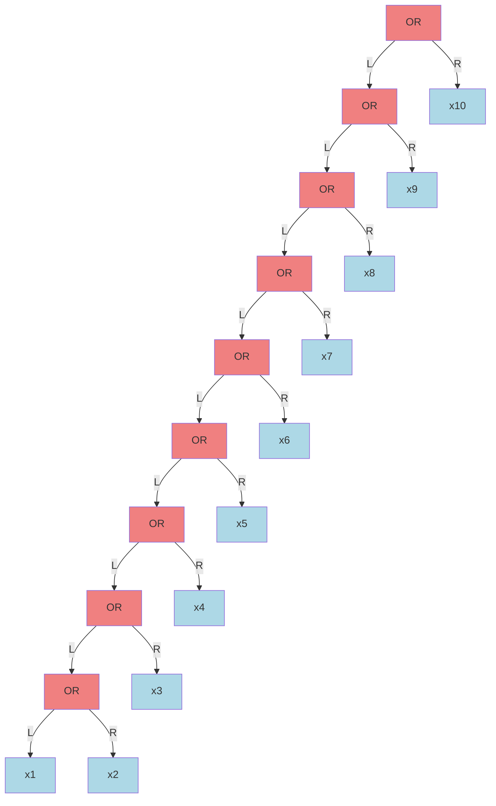

```mermaid
%%{ init: {"theme": "default"} }%%
graph TB
  node000["OR"]
  style node000 fill:lightcoral
  node001["OR"]
  style node001 fill:lightcoral
  node002["x10"]
  style node002 fill:lightblue
  node003["OR"]
  style node003 fill:lightcoral
  node004["x9"]
  style node004 fill:lightblue
  node005["OR"]
  style node005 fill:lightcoral
  node006["x8"]
  style node006 fill:lightblue
  node007["OR"]
  style node007 fill:lightcoral
  node008["x7"]
  style node008 fill:lightblue
  node009["OR"]
  style node009 fill:lightcoral
  node010["x6"]
  style node010 fill:lightblue
  node011["OR"]
  style node011 fill:lightcoral
  node012["x5"]
  style node012 fill:lightblue
  node013["OR"]
  style node013 fill:lightcoral
  node014["x4"]
  style node014 fill:lightblue
  node015["OR"]
  style node015 fill:lightcoral
  node016["x3"]
  style node016 fill:lightblue
  node017["x1"]
  style node017 fill:lightblue
  node018["x2"]
  style node018 fill:lightblue
  node000 -- "L" --> node001
  node000 -- "R" --> node002
  node001 -- "L" --> node003
  node001 -- "R" --> node004
  node003 -- "L" --> node005
  node003 -- "R" --> node006
  node005 -- "L" --> node007
  node005 -- "R" --> node008
  node007 -- "L" --> node009
  node007 -- "R" --> node010
  node009 -- "L" --> node011
  node009 -- "R" --> node012
  node011 -- "L" --> node013
  node011 -- "R" --> node014
  node013 -- "L" --> node015
  node013 -- "R" --> node016
  node015 -- "L" --> node017
  node015 -- "R" --> node018
```
