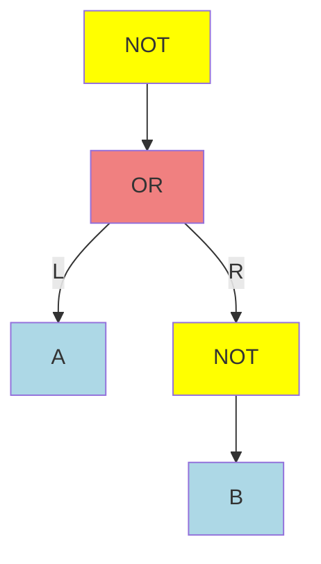

```mermaid
%%{ init: {"theme": "default"} }%%
graph TB
  node000["NOT"]
  style node000 fill:yellow
  node001["OR"]
  style node001 fill:lightcoral
  node002["A"]
  style node002 fill:lightblue
  node003["NOT"]
  style node003 fill:yellow
  node004["B"]
  style node004 fill:lightblue
  node000 --> node001
  node001 -- "L" --> node002
  node001 -- "R" --> node003
  node003 --> node004
```
