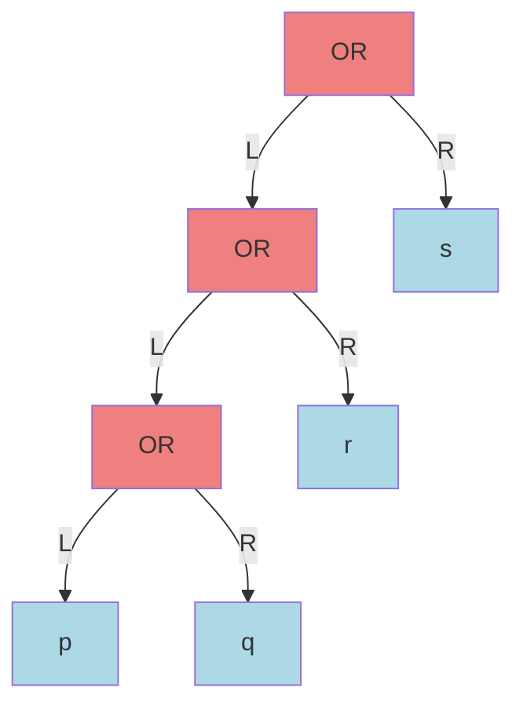

```mermaid
%%{ init: {"theme": "default"} }%%
graph TB
  node000["OR"]
  style node000 fill:lightcoral
  node001["OR"]
  style node001 fill:lightcoral
  node002["s"]
  style node002 fill:lightblue
  node003["OR"]
  style node003 fill:lightcoral
  node004["r"]
  style node004 fill:lightblue
  node005["p"]
  style node005 fill:lightblue
  node006["q"]
  style node006 fill:lightblue
  node000 -- "L" --> node001
  node000 -- "R" --> node002
  node001 -- "L" --> node003
  node001 -- "R" --> node004
  node003 -- "L" --> node005
  node003 -- "R" --> node006
```
