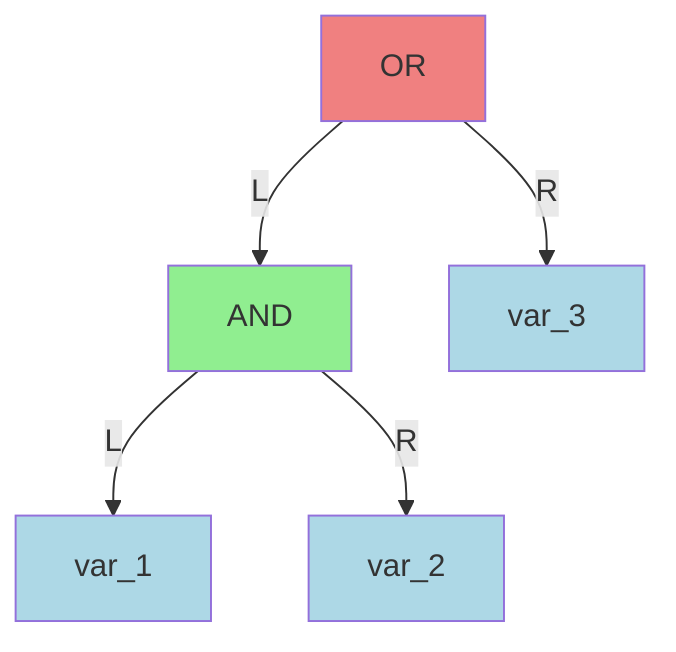

```mermaid
%%{ init: {"theme": "default"} }%%
graph TB
  node000["OR"]
  style node000 fill:lightcoral
  node001["AND"]
  style node001 fill:lightgreen
  node002["var_3"]
  style node002 fill:lightblue
  node003["var_1"]
  style node003 fill:lightblue
  node004["var_2"]
  style node004 fill:lightblue
  node000 -- "L" --> node001
  node000 -- "R" --> node002
  node001 -- "L" --> node003
  node001 -- "R" --> node004
```
